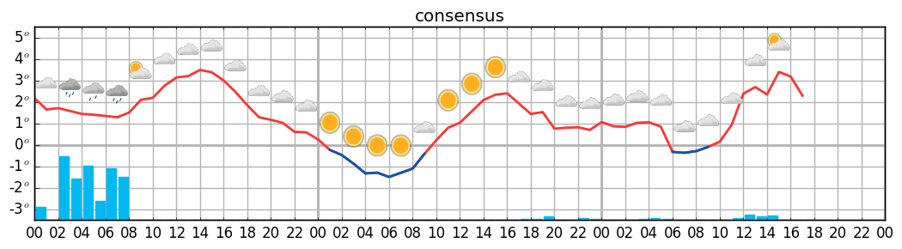

Yr-meteogram
============

This package allows testing of different strategies for creating deterministic forecasts from an
ensemble. The forecasts are visualized using an imitation of the short-range meteogram found on https://www.yr.no.

Installation on ubuntu
----------------------

Clone the repository into an appropriate folder:

.. code-block:: bash

  git clone https://github.com/metno/yrmeteo.git
  cd yrmeteo
  
Load the Yr weather-symbols, but running:

.. code-block:: bash

  git submodule init

Install the required pacakges:

.. code-block:: bash

  sudo apt-get update
  sudo apt-get install netcdf-bin libnetcdf-dev libhdf5-serial-dev
  sudo apt-get install python-setuptools python-pip
  sudo apt-get install python-numpy python-scipy python-matplotlib

Download the source code, then install ``yrmeteo`` by executing the following inside the extracted
folder:

.. code-block:: bash

  sudo pip install -e .

This will create the executable ``/usr/local/bin/yrmeteo``. If ``/usr/local/bin`` is not in your PATH
environment variable, then add it (i.e add ``export PATH=/usr/local/bin/:$PATH`` to ``~/.bashrc``).

Usage
-----

.. code-block:: bash

  yrmeteo -lat 59.9127 -lon 10.7461 -m consensus

When an input file is not specified, Yrmeteo loads the most recent MEPS file from thredds.met.no.

Copyright and license
---------------------

Copyright (C) 2017 MET Norway. Yrmeteo is licensed under `LGPL version 3
<https://github.com/metno/yrmeteo/blob/master/LICENSE>`_ or (at your option) any later version. The
weather symbols used have its own license, see yrmeteo/weather-symbols/LICENSE.
